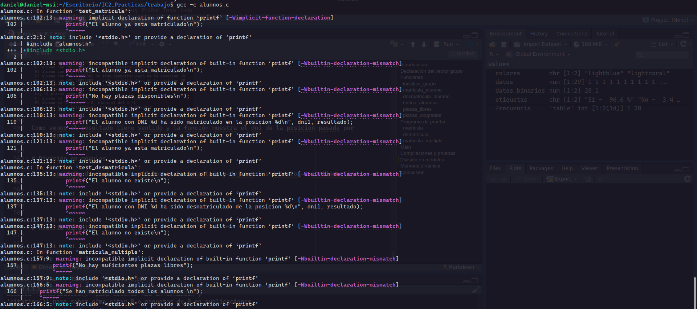
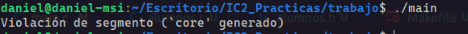
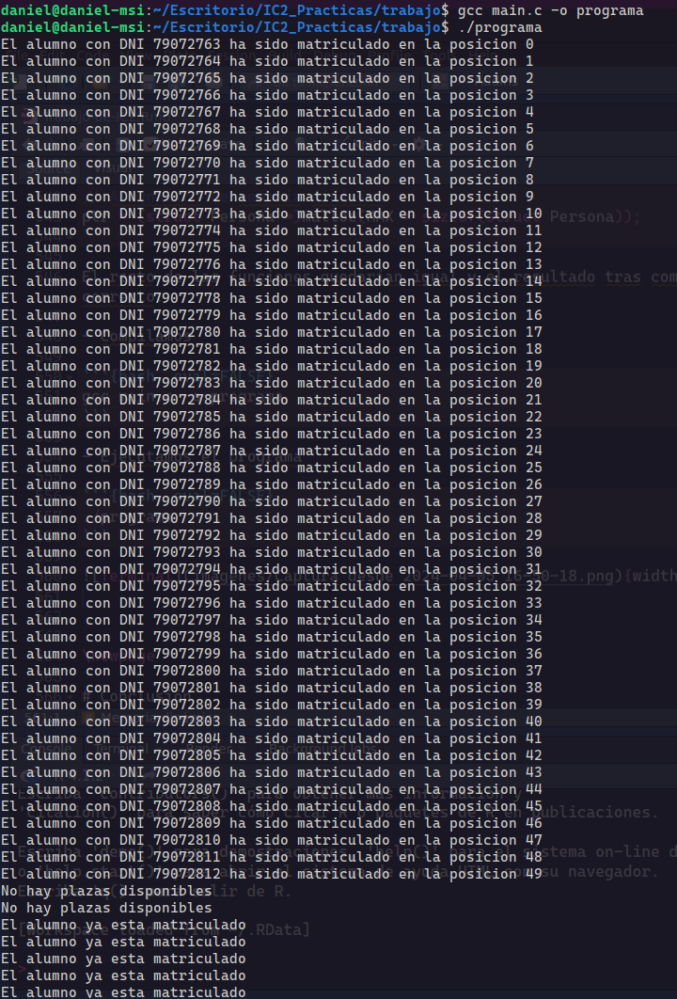

```{r setup, include=FALSE}
knitr::opts_chunk$set(echo = TRUE)
```

\newpage

# Introducción

La práctica titulada "Caso práctico en el desarrollo en C", constituye una oportunidad fundamental para profundizar
en diversos aspectos del lenguaje C. A lo largo de este ejercicio, los paraticipantes explorarán conceptos esenciales
como punteros, vectores, struct y funciones, todos ellos pilares fundamentales en el dominio de la programación en C.

Esta práctica se presenta como un desafío integral, donde los participantes tendrán la oportunidad de poner en práctica sus conocimientos teóricos y habilidades técnicas adquiridas hasta el momento.

El desarrollo del trabajo se divide de la siguiente forma entre los integrantes del grupo:

- **Daniel Rodriguez Aonso**

    Se encargo del desarrollo de las funciones de test tanto de la testea_matricula como testea_desmatricula y matricula multiple, definción del struct, tambien compiló y ejecutó el programa cierto número de veces.

- **Sofia Travieso García**

    Se encargó del desarrollo del las funciones de matricula alumno y desmatricula alumno como la de testea asiento, también compiló y explicó las funcionalidades de las funciones en el PDF y desarrolló su maquetación.
    
- **Jaime Rivero Santana**

    Participó en el desarrollo de las funciones de inicializa grupo, plazas_libres, plazas_ocupadas. Se encargo de cierta parte de la maquetación del trabajo, y compiló el programa ciertas veces para ver su funcionamiento.
    
    
El desarrollo de la práctica se dividirá en las siguientes actividades:

# Declaración del vector grupo

Para la delcaración del vector grupo que tiene que ser de MAX 50 persona hemos creado directamente el vector utilizando el struct de Persona

```{c, eval=FALSE}
// Definición de la estructura
struct Persona
{
    int dni;
    char nombre[10];
    char apellidos[20];
    int numero_matricula;
} *ptr;
```

En la definicion de este struct declaramos un dni, nombre, apellido y numero de matricula. Además, al final, definiremos un puntero global que va a tener acceso a todo el programa y que solo va a poder apuntar a un struct de ese tipo.

Luego en el main declaramos en vector de grupo con máximo 50 alumnos.

```{c, eval=FALSE}
#define MAX 50

int main()
{
    struct Persona clase[MAX];
    ptr = clase;
    return 0;
}
```

Para definir el tamaño del vector utilizamos una constante que estará definida igualmente para todo el programa, por lo tanto, no podrá cambiar de valor. En esta parte del desarrollo, también le indicaremos al puntero “ptr” que apunte a la primera posición del vector clase.


Este código se puede representar gráficamente a través de PythonTutor.


{width=100%}

Ahora pasamos al desarrollo de las funciones

# Funciones

## incializa_grupo

La primera funcion que desarrollamos es la de inicializa_grupo:

```{c, eval=FALSE}
int inicializa_grupo()
{
    for (int i = 0; i < MAX; i++)
    {
        ptr[i].dni = -1;
    }
    return 0;
};
```

Esta función se utilizará para ejecutar el programa, poniendo en todas las posiciones el dni = -1. Esto nos indicará que no hay nadie matriculado en esa posición.

## matricula_alumno

```{c, eval=FALSE}
int matricular_alumno(int dni)
{
    // Comprobar si el alumno ya esta matriculado
    for (int i = 0; i < MAX; i++)
    {
        if (ptr[i].dni == dni)
        {
            return -2;
        }
    }
    // Matriculando al alumno
    for (int i = 0; i < MAX; i++)
    {
        if (ptr[i].dni == -1)
        {
            ptr[i].dni = dni;
            return i;
        }
    }
    return -1;
}
```

Esta función servirá para poder asignarle una plaza a un alumno, es decir, matricularlo. Primero se comprueba que la persona no está previamente matriculada que, de ser así, la función devolverá -2. Si el alumno no está matriculado, se buscará una posición del vector con dni = -1, lo que significa que esa posición está libre y el valor de dni cambiará a ser el dni del alumno. Además, devolverá su posición en el vector. En caso de que el vector se encuentre lleno, no se matricula el alumno y la función devuelve -1.

## desmatricula_alumno

```{c, eval=FALSE}
int desmatricular_alumno(int dni)
{
    // Buscando al alumno e iterando para desmatricularlo
    for (int i = 0; i < MAX; i++)
    {
        if (ptr[i].dni == dni)
        {
            ptr[i].dni = -1;
            return i;
        }
    }
    return -1;
}
```

Al contrario que la función “matricular_alumno”, esta función recibe por parámetro un dni que buscará usando el puntero que apunta al vector de clase. Cuando lo encuentre, pondrá el valor dni de esa posición a -1, lo que significa que queda libre.

## testea_alumnos

```{c, eval=FALSE}
int testea_alumnos(int posicion)
{
    if (posicion < 0 || posicion >= MAX)
    {
        return -2;
    }
    return ptr[posicion].dni;
}
```

Esta función testea una posición en el vector pasando por parámetro un número. Si el número es menor que 0 o mayor que 50, devuelve -2, ya que se está intentando acceder a una posición que no se encuentra disponible. En caso de que no se cumpla lo anterior, la función devolverá el dni de la persona que esté matriculada o un -1 si esa posición está libre.

## plazas_libres

```{c, eval=FALSE}
int plazas_libres()
{
    int count;
    count = 0;
    for (int i = 0; i < MAX; i++)
    {
        if (ptr[i].dni == -1)
        {
            count++;
        }
    }
    return count;
}
```

Esta función no recibe ningún argumento por parámetro. Definimos un contador que recorre el vector de clase y se incrementa a medida que encuentra una posición a -1.

## plazas_ocupadas

```{c, eval=FALSE}
int plazas_ocupadas()
{
    int count;
    count = 0;
    for (int i = 0; i < MAX; i++)
    {
        if (ptr[i].dni != -1)
        {
            count++;
        }
    }
    return count;
}
```

Esta función tiene la misma lógica que la función “plazas_libres”. La diferencia es que, en cada iteración, va comprobando si el dni es distinto a -1. Esto significa que la plaza está ocupada y, por tanto, se incrementa el contador.


# Programa de prueba

En esta sección del desarrollo, crearemos funciones específicas para poder poner a prueba el funcionamiento de las funciones definidas anteriormente. Las ejecutaremos con parámetros no esperados, observando su comportamiento.

## matricula

```{c, eval=FALSE}
void test_matricula(int dni)
{
    for (int i = 0; i < MAX + 2; i++)
    {
        int dni1;
        dni1 = dni + i;
        int resultado = matricular_alumno(dni1);
        if (resultado == -2)
        {
            printf("El alumno ya esta matriculado\n");
        }
        else if (resultado == -1)
        {
            printf("No hay plazas disponibles\n");
        }
        else
        {
            printf("El alumno con DNI %d ha sido matriculado en la posicion %d\n", 
                   dni1, resultado);
        }
    }
    // Comprobando que el alumno ya esta matriculado
    for (int i = 0; i < 5; i++)
    {
        int dni1;
        dni1 = dni + i;
        int resultado = matricular_alumno(dni1);
        if (resultado == -2)
        {
            printf("El alumno ya esta matriculado\n");
        }
    }
}
```

El uso de esta función es poder testear la función “matricula_alumno” en donde realizamos una iteración matriculando diversos dnis. Dependiendo del resultado, imprimimos por pantalla diferentes mensajes.

## dematricula

```{c, eval=FALSE}
void test_desmatricula(int dni)
{
    for (int i = 0; i < MAX - 10; i++)
    {
        int dni1;
        dni1 = dni + i;
        int resultado = desmatricular_alumno(dni1);
        if (resultado == -1)
        {
            printf("El alumno no existe\n");
        } else {
            printf("El alumno con DNI %d ha sido desmatriculado de la posicion %d\n", 
                   dni1, resultado);
        }
    }
    for (int i = 0; i < 3; i++)
    {
        int dni1;
        dni1 = dni + i;
        int resultado = desmatricular_alumno(dni1);
        if (resultado == -1)
        {
            printf("El alumno no existe\n");
        }
    }
}
```

Esta función testea la función “desmatricula_alumno” llamándola un número MAX de veces y pasándole un dni diferente en cada iteración. Cuando se llama la función test, dependiendo del resultado, imprime un mensaje u otro.

## matricula_multiple

```{c, eval=FALSE}
void matricula_multiple(int npersonas, int dnis[])
{
    int plazas = plazas_libres();
    if (plazas < npersonas)
    {
        printf("No hay suficientes plazas libres");
        return;
    }

    // Matricular a cada persona de la lista
    for (int i = 0; i < npersonas; i++)
    {
        matricular_alumno(dnis[i]);
    }
    printf("Se han matriculado todos los alumnos \n");
}
```

“matricula_multiple” es una función que trata de matricular a un conjunto de alumnos que se pasan por parámetro. Sólo se matriculan en caso de que exista la misma cantidad de espacios libres que de alumnos que se quieren matricular. En caso contrario, no se matriculará a ninguno.

# Main

Aquí se mostrará la parte del código que contiene el main().

```{c, eval=FALSE}
int main()
{
    // Crear el vector de estructuras
    int dnis[2] = {1234567, 1324567};
    struct Persona clase[MAX];
    ptr = clase;
    inicializa_grupo();
    test_matricula(79072763);
    test_desmatricula(79072763);
    matricula_multiple(2, dnis);
    int resultado = plazas_libres();
    printf("Hay %d plazas libres\n", resultado);
    int resultado2 = plazas_ocupadas();
    printf("Hay %d plazas ocupadas\n", resultado2);
    printf("El alumno en la posición %d, tiene el dni = %d\n", 1, testea_alumnos(1));
    printf("El alumno en la posición %d, tiene el dni = %d\n", 5, testea_alumnos(5));
    printf("El alumno en la posición %d, tiene el dni = %d\n", 48, testea_alumnos(48));
    return 0;
}
```

# Compilaciones y pruebas

En la compilación del código ejecutamos los siguientes comandos:

- Compilamos

```{bash, eval=FALSE}
gcc main.c -o programa
```

- Ejecutamos el programa 

```{bash, eval=FALSE}
./programa
```

\newpage

- Y visualizamos el resultado

{width=100%}

Vemos que al probar las funciones “testea_martricula” y “testea_desmatricula”, funcionan perfectamente, rellena el vector clase y luego los desmatricula.  

Ahora vamos a intentar compilar el programa matriculando más de 50 alumnos y  no desmatriculándolos todos para ver si funciona el código y las funciones “plazas_libres” y “plazas_ocupadas”.

{width=100%}

Al intentar compilar este programa vemos que nos salta un error que es bastante sencillo de solucionar. Se trata de que en el apartado de main() de nuestro trabajo, duplicamos la variable de resultado 2 veces. Cambiando el nombre a esta variable solucionamos el problema y podremos compilar el programa.

\newpage

- **Antes**

```{c, eval=FALSE}
int main()
{
    // Crear el vector de estructuras
    int dnis[2] = {1234567, 1324567};
    struct Persona clase[MAX];
    ptr = clase;
    inicializa_grupo();
    test_matricula(79072763);
    test_desmatricula(79072763);
    matricula_multiple(2, dnis);
    int resultado = plazas_libres();
    printf("Hay %d plazas libres\n", resultado);
    int resultado = plazas_ocupadas();
    printf("Hay %d plazas ocupadas\n", resultado);
    return 0;
}
```


- **Despues**

```{c, eval=FALSE}
int main()
{
    // Crear el vector de estructuras
    int dnis[2] = {1234567, 1324567};
    struct Persona clase[MAX];
    ptr = clase;
    inicializa_grupo();
    test_matricula(79072763);
    test_desmatricula(79072763);
    matricula_multiple(2, dnis);
    int resultado = plazas_libres();
    printf("Hay %d plazas libres\n", resultado);
    int resultado2 = plazas_ocupadas(); // Cambio de resultado -> resultado2
    printf("Hay %d plazas ocupadas\n", resultado);
    return 0;
}

```

\newpage

{width=100%}

En esta compilación el programa funciona pero nos aparece que hay el mismo numero de plazas ocupadas que de plazas libres, y nos dimos cuenta del problema que se encontraba en el main():

- **Antes**

```{c, eval=FALSE}
int main()
{
    // Crear el vector de estructuras
    int dnis[2] = {1234567, 1324567};
    struct Persona clase[MAX];
    ptr = clase;
    inicializa_grupo();
    test_matricula(79072763);
    test_desmatricula(79072763);
    matricula_multiple(2, dnis);
    int resultado = plazas_libres();
    printf("Hay %d plazas libres\n", resultado);
    int resultado2 = plazas_ocupadas();
    printf("Hay %d plazas ocupadas\n", resultado);
    return 0;
}
```


- **Después**

```{c, eval=FALSE}
int main()
{
    // Crear el vector de estructuras
    int dnis[2] = {1234567, 1324567};
    struct Persona clase[MAX];
    ptr = clase;
    inicializa_grupo();
    test_matricula(79072763);
    test_desmatricula(79072763);
    matricula_multiple(2, dnis);
    int resultado = plazas_libres();
    printf("Hay %d plazas libres\n", resultado);
    int resultado2 = plazas_ocupadas();
    // Cambiamos resultado -> resultado2
    printf("Hay %d plazas ocupadas\n", resultado2);
    return 0;
}
```


El problema se encuentra en que, en el segundo printf, imprimimos la misma variable. Por eso, el resultado es dos veces el mismo. Cambiando eso, se solucionaría el problema.  

Volvemos a compilar el programa y vemos cómo esta vez el resultado sí es correcto. Se matriculan 52 alumnos y, cuando llega a su límite, salta el mensaje: “No hay plazas disponibles”. Consecutivamente se desmatriculan 40 alumnos. Cuando terminan esos procesos, se matriculan dos alumnos con la función “matricula_multiple()” y salta el mensaje: “Se han matriculado todos los alumnos”. Por último, saltan los mensajes: “Hay 38 plazas libres” y “Hay 12 plazas ocupadas” teniendo todo el sentido ya que 38 + 12 = 50.

{width=100%}

En la última compilación vamos a probar la función “testea_alumno” en la que le pasas una posición y te devuelve el dni de la persona en esa posición.

Mostramos las lineas de código que ejecutaran la función varias veces:

```{c, eval=FALSE}
int main()
{
    // Crear el vector de estructuras
    int dnis[2] = {1234567, 1324567};
    struct Persona clase[MAX];
    ptr = clase;
    inicializa_grupo();
    test_matricula(79072763);
    test_desmatricula(79072763);
    matricula_multiple(2, dnis);
    int resultado = plazas_libres();
    printf("Hay %d plazas libres\n", resultado);
    int resultado2 = plazas_ocupadas();
    //-------- testea_alumnos-----------------------
    printf("Hay %d plazas ocupadas\n", resultado2);
    printf("El alumno en la posición %d, tiene el dni = %d\n", 1, testea_alumnos(1));
    printf("El alumno en la posición %d, tiene el dni = %d\n", 5, testea_alumnos(5));
    printf("El alumno en la posición %d, tiene el dni = %d\n", 48, testea_alumnos(48));
    //-------- fin testa_alumnos--------------------
    return 0;
}
```

{width=50%}

Como vemos el resultado tiene sentido y la función muestra el dni de la posición pasada por parámtero.

\newpage

# División en módulos

En el apartado de division de módulos se ha intentado y dejamos los intentos a continuación:

```{bash, eval=FALSE}
gcc -c alumnos.c
```

{width=100%}

```{bash, eval=FALSE}
gcc -c main.c
```

Este comando se ejecuta sinningún error

```{bash, eval=FALSE}
gcc -o main main.o alumnos.o
```

Esta comando tampoco da ningun error al ejecutarse

- Ejecutamos el programa

```{bash, eval=FALSE}
./main
```

Al intentar ejecutar el programa nos salta el siguiente error.

{width=100%}

\newpage

# Memoria dinámica

En este apartado intentamos la memoria dinámica y el codigo quedaría de la siguiente manera

Declaramos el puntero con memoria dinámica

```{c, eval=FALSE}
// Asignación de memoria dinámica
ptr = (struct Persona *)malloc(MAX * sizeof(struct Persona));
```

El resto de las funciones quedarían igual y el resultado tras compilar y ejecutar el codigo sería correcto.

- Compilamos

```{bash, eval=FALSE}
gcc main.c -o programa
```

- Ejecutamos el programa 

```{bash, eval=FALSE}
./programa
```

{width=50%}


\newpage

# Conclusión

El desarrollo de este trabajo nos ha dado la oportunidad de profundizar en diversos aspectos del lenguaje de C. Hemos visto elementos esenciales como punteros, vectores, struct y funciones, siendo conscientes de la posibilidad de mejora de este trabajo. Dejamos por escrito las ganas que tenemos de mejorar y añadir mejores funcionalidades como memoria dinámica para siguientes entregas. Adjuntamos un link de [GitHub] donde está el repositorio del trabajo con todas las versiones.


[GitHub]: https://github.com/danirodriguezz/Trabajo-IC2


