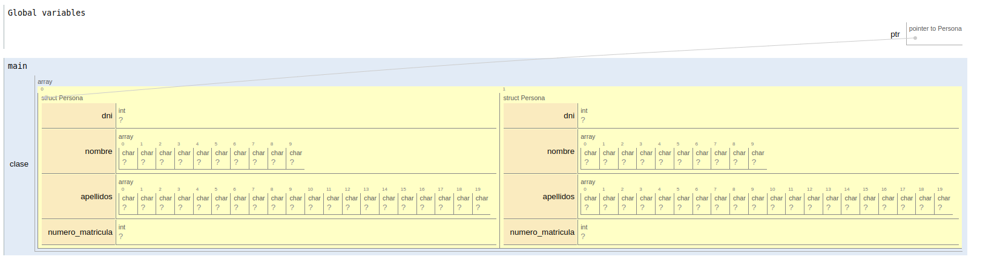
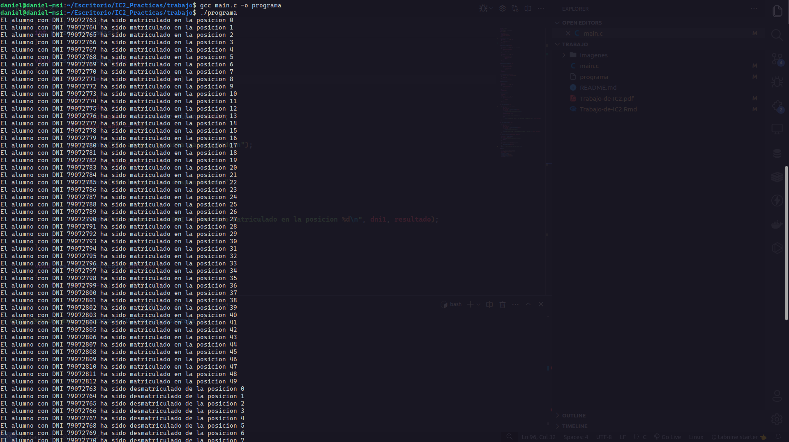
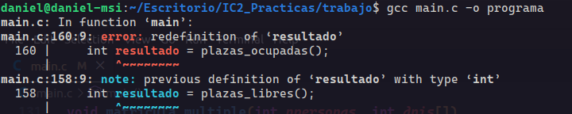
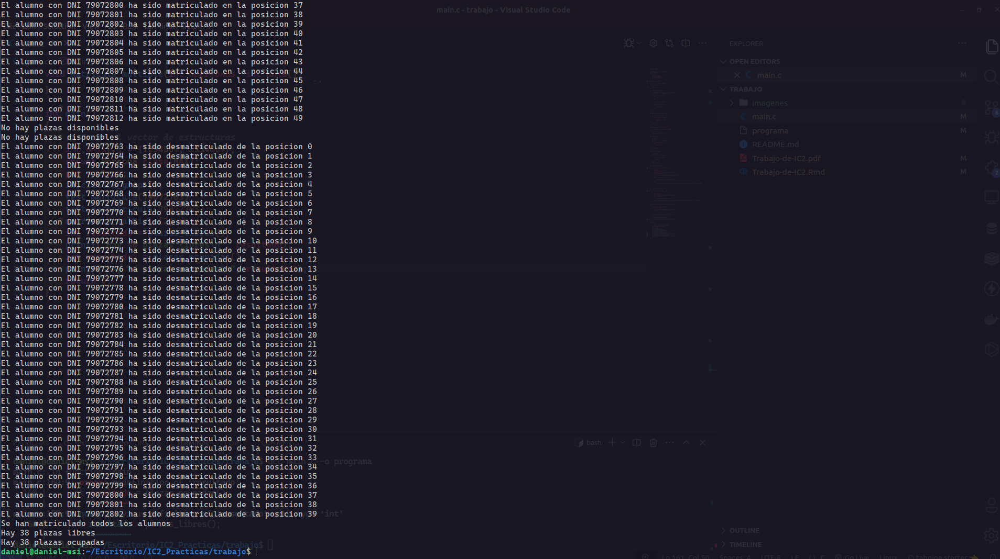
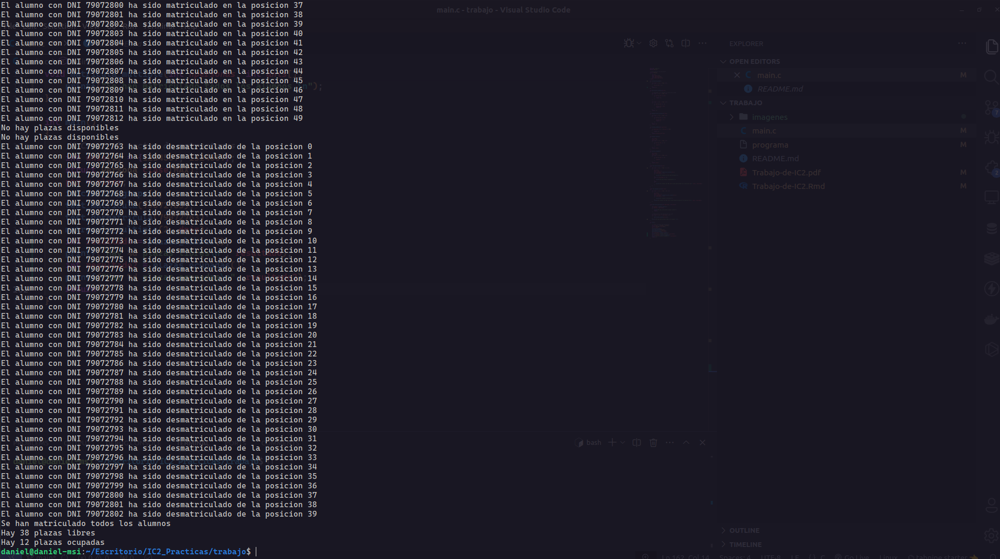
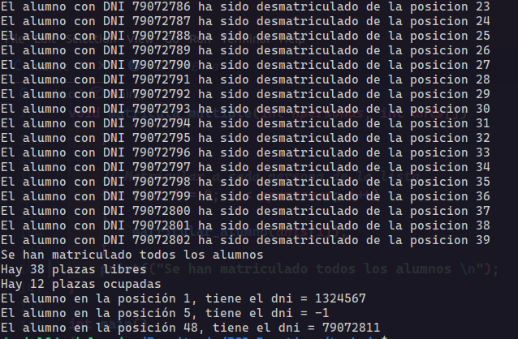

```{r setup, include=FALSE}
knitr::opts_chunk$set(echo = TRUE)
```

\newpage

# Introducción

La practica titulada "Caso práctico en el desarrollo en C", constituye una oportunidad fundamental para profundizar
en diversos aspectos del lenguaje C. A lo largo de este ejercicio, los paraticipantes explorarán conceptos esenciales
como punteros, vectores, struct y funciones, todos ellos pilares fundamentales en el dominio de la programación en C.

Esta práctica se presenta como un desafío integral, donde los participantes tendrán la oportunidad de poner en práctica sus conocimientos teóricos y habilidades técnicas adquiridas hasta el momento.

El desarrollo de la practica se dividirá en las siguientes actividades:

# Declaración del vector grupo

Para la delcaración del vector grupo que tiene que ser de MAX 50 persona hemos creado directamente el vector utilizando el struct de Persona

```{c, eval=FALSE}
// Definición de la estructura
struct Persona
{
    int dni;
    char nombre[10];
    char apellidos[20];
    int numero_matricula;
} *ptr;
```

En la definicion de esta struct le definimos un dni, nombre, apellido, numero_matricula. Y al final de la definición de ese struct
declaramos un puntero global que va a tener acceso todo el programa y que solo va a poder apuntar a un struct de ese tipo.

Luego en el main declaramos en vector de grupo con máximo 50 alumnos.

```{c, eval=FALSE}
#define MAX 50

int main()
{
    struct Persona clase[MAX];
    ptr = clase;
    return 0;
}
```

Para definir el tamaño del vector utilizamos una constante que estara definida igualmente para todo el programa
pero que no podrá cambiar de valor. En esta parte del desarrollo tambien le decimos al puntero $ptr$ que va a apuntar
a la primera posición del vector clase.

\newpage

Este codigo se puede representar gráficamente a traves de PythonTutor.


{width=100%}

Ahora pasamos al desarrollo de las funciones

# Funciones

## incializa_grupo

La primera funcion que desarrollamos es la de inicializa_grupo:

```{c, eval=FALSE}
int inicializa_grupo()
{
    for (int i = 0; i < MAX; i++)
    {
        ptr[i].dni = -1;
    }
    return 0;
};
```

Esta funcion se utilizara nada mas ejecutar el prgrama para poder poner en todas las posiciones el dni = -1, esto nos indicará que no hay nadie matriculado en esa posición.

## matricula_alumno

```{c, eval=FALSE}
int matricular_alumno(int dni)
{
    // Comprobar si el alumno ya esta matriculado
    for (int i = 0; i < MAX; i++)
    {
        if (ptr[i].dni == dni)
        {
            return -2;
        }
    }
    // Matriculando al alumno
    for (int i = 0; i < MAX; i++)
    {
        if (ptr[i].dni == -1)
        {
            ptr[i].dni = dni;
            return i;
        }
    }
    return -1;
}
```

Esta función servirá para poder asignarle una plaza a un alumno, en donde comprueba primero que no esta matriculado, que en caso de ser asi devolverá un -2, si el alumno no estaba matriculado buscará una posición donde el valor dni = -1 lo que significa que esa posición esta libre y pondrá el valor del dni que se quiere matricular en esa posición, devolviendo la posición del dni guardado. En caso de que el vector se encuentre lleno y no se matriculará el alumno y la función devolverá un -1.

## desmatricula_alumno

```{c, eval=FALSE}
int desmatricular_alumno(int dni)
{
    // Buscando al alumno e iterando para desmatricularlo
    for (int i = 0; i < MAX; i++)
    {
        if (ptr[i].dni == dni)
        {
            ptr[i].dni = -1;
            return i;
        }
    }
    return -1;
}
```

Al contrario de la funcion de matricular_alumno, esta función resive por parámetro un dni que buscara usando el puntero que apunta al vector de clase y cuando los encuentre pone el valor de dni de esa posición a -1 lo que significa que queda libre esa posición

## testea_alumnos

```{c, eval=FALSE}
int testea_alumnos(int posicion)
{
    if (posicion < 0 || posicion >= MAX)
    {
        return -2;
    }
    return ptr[posicion].dni;
}
```

Esta función testea la posición de un alumno, esa posición se pasa por parametro que en caso de que esa posicion sea menor que 0 o mayor que el tamaño del vector devolvera un -2 ya que se esta intentando acceder a una posición que no esta disponible, en caso que no se cumpla lo anterior la función devolverá el dni de la persona que este matriculada en esa posición o un -1 si esa posición esta libre.

## plazas_libres

```{c, eval=FALSE}
int plazas_libres()
{
    int count;
    count = 0;
    for (int i = 0; i < MAX; i++)
    {
        if (ptr[i].dni == -1)
        {
            count++;
        }
    }
    return count;
}
```

Esta función no resive ningun argumento por parametro, lo unico que hace es denifinir un contador y recorrer el vector de clase y va incrementando el contador cada vez que encuentre una posición con el dni a -1.

## plazas_ocupadas

```{c, eval=FALSE}
int plazas_ocupadas()
{
    int count;
    count = 0;
    for (int i = 0; i < MAX; i++)
    {
        if (ptr[i].dni != -1)
        {
            count++;
        }
    }
    return count;
}
```

Esta funcion tiene la misma lógica que la función de plazas_libres lo unico que en cada iteración va comprobando si el dni es distinto a -1 lo que significará que la plaza esta ocupada y incrementará el contador, cuando termine de iterar devuleve el contador.


# Programa de prueba

En esta seccion del desarrollo crearemos funciones especificas para poder poner a prueba el funcionamiento de las funciones ya definidas y ejecutarlas con parametros no esperados por las funciones observando su comportamiento.

## matricula

```{c, eval=FALSE}
void test_matricula(int dni)
{
    for (int i = 0; i < MAX + 2; i++)
    {
        int dni1;
        dni1 = dni + i;
        int resultado = matricular_alumno(dni1);
        if (resultado == -2)
        {
            printf("El alumno ya esta matriculado\n");
        }
        else if (resultado == -1)
        {
            printf("No hay plazas disponibles\n");
        }
        else
        {
            printf("El alumno con DNI %d ha sido matriculado en la posicion %d\n", dni1, resultado);
        }
    }
    // Comprobando que el alumno ya esta matriculado
    for (int i = 0; i < 5; i++)
    {
        int dni1;
        dni1 = dni + i;
        int resultado = matricular_alumno(dni1);
        if (resultado == -2)
        {
            printf("El alumno ya esta matriculado\n");
        }
    }
}
```

El uso de esta función es para poder testear la función de matricula_alumno en donde realizamos una iteracion matriculando diversos dnis y dependiendo del resultado imprimimos por pantalla diferentes mensajes.

## dematricula

```{c, eval=FALSE}
void test_desmatricula(int dni)
{
    for (int i = 0; i < MAX - 10; i++)
    {
        int dni1;
        dni1 = dni + i;
        int resultado = desmatricular_alumno(dni1);
        if (resultado == -1)
        {
            printf("El alumno no existe\n");
        } else {
            printf("El alumno con DNI %d ha sido desmatriculado de la posicion %d\n", 
                   dni1, resultado);
        }
    }
    for (int i = 0; i < 3; i++)
    {
        int dni1;
        dni1 = dni + i;
        int resultado = desmatricular_alumno(dni1);
        if (resultado == -1)
        {
            printf("El alumno no existe\n");
        }
    }
}
```

Esta función testea la función de desmatricula_alumno llamándola un número MAX de veces y pansandole un dni diferente en cada iteración. Cuando se llama la función test dependiendo del resultado imprime un mensaje u otro

## matricula_multiple

```{c, eval=FALSE}
void matricula_multiple(int npersonas, int dnis[])
{
    int plazas = plazas_libres();
    if (plazas < npersonas)
    {
        printf("No hay suficientes plazas libres");
        return;
    }

    // Matricular a cada persona de la lista
    for (int i = 0; i < npersonas; i++)
    {
        matricular_alumno(dnis[i]);
    }
    printf("Se han matriculado todos los alumnos \n");
}
```

matricula multiple es una función que trata de matricular a un conjunto de alumnos que se pasa por parametro y que solo los matriculara en caso de que hubiese le mismos de espacios libres que de alumnos que se quieren matricular en caso contrario no se matriculará a ninguno.

# Main

Aqui mostraremos la parte del codigo que tiene el main()

```{c, eval=FALSE}
int main()
{
    // Crear el vector de estructuras
    int dnis[2] = {1234567, 1324567};
    struct Persona clase[MAX];
    ptr = clase;
    inicializa_grupo();
    test_matricula(79072763);
    test_desmatricula(79072763);
    matricula_multiple(2, dnis);
    int resultado = plazas_libres();
    printf("Hay %d plazas libres\n", resultado);
    int resultado2 = plazas_ocupadas();
    printf("Hay %d plazas ocupadas\n", resultado2);
    printf("El alumno en la posición %d, tiene el dni = %d\n", 1, testea_alumnos(1));
    printf("El alumno en la posición %d, tiene el dni = %d\n", 5, testea_alumnos(5));
    printf("El alumno en la posición %d, tiene el dni = %d\n", 48, testea_alumnos(48));
    return 0;
}
```

# Compilaciones y pruebas

En la compilacion del código ejecutamos los siguientes comandos

```{bash, eval=FALSE}
gcc main.c -o programa
```

Y ejecutamos el programa 

```{bash, eval=FALSE}
./programa
```

y visualizamos el resultado

{width=90%}

Vemos que al probar las funciones de testea martricula y testea desmatricula funciona perfectamente y rellena el vector clase y luego los desmatricula entero. 

Ahora vamos a intentar compilar el trabajo itentando matricular mas de 50 alumnos y y no desmatriculandolos todos para ver si funciona el codigo y las funciones de plazas libres y plazas ocupadas.

{width=100%}

Al intentar compilar este programa vemos que nos salta un error que es bastante secillo de solucionar, se trata de que en el apartado de main() de nuestro trabajo duplicamos la variable de resultado 2 veces, cambiando el nombre a esta variable solucionamos el problema y podremso compilar el programa.


{width=100%}

En esta compilación el programa funciona pero nos aparece que hay el mismo numero de plazas ocupadas que de plazas libres, y nos dimos cuenta del problema que se encontraba en el main():

```{c, eval=FALSE}
int main()
{
    // Crear el vector de estructuras
    int dnis[2] = {1234567, 1324567};
    struct Persona clase[MAX];
    ptr = clase;
    inicializa_grupo();
    test_matricula(79072763);
    test_desmatricula(79072763);
    matricula_multiple(2, dnis);
    int resultado = plazas_libres();
    printf("Hay %d plazas libres\n", resultado);
    int resultado2 = plazas_ocupadas();
    printf("Hay %d plazas ocupadas\n", resultado);
    return 0;
}
```

El problema se ecuentra en que en el segundo printf imprimimos la misma variable por eso el resultado es dos veces el mismo, cambiando eso se solucionaría el problema.

Volvemos a compilar el programa y vemos como esta vez el resultado si es correcto donde se matriculan 52 alumnos y cuando llega a su límite te salta el mensaje de "No hay plazas disponibles" y consecutivamente se desmatriculan 40 alumnos, cuando termina esos procesos se matriculan dos alumnos con la funcion de matricula_multiple() y salta el mensaje de "Se han matriculado todos los alumnos", por ultimo santa los mensajes de "Hay 38 plazas libres" y "Hay 12 plazas ocupadas"
teniendo todo el sentido ya que 38 + 12 = 50 el número de alumnos máximo por clase.


{width=100%}

La última compilación vamos a probar la funcion de testea_alumno en el que le pasas una posicion y te devuelve el dni de la persona en esa posición.

\newpage

{width=50%}

Como vemos el resultado tiene sentido y la función muestra el dni de la posición pasada por parámtero.


# Conclusión

El desarrollo de este trabajo nos ha dado la oportunidad de profundizar en diversos aspectos del lenguaje de C. En el que hemos visto elementos esenciales como punteros, vectores, struct y funciones, siendo concientes de la posibilidad de mejora de este trabajo dejamos por escrito las ganas que tenemos de mejorar y aladir mejores funcionalidades como memoria dinámica para siguientes entregas adjuntamos un link de [GitHub] donde esta el repositorio del trabajo con todas las versiones.

[GitHub]: https://github.com/danirodriguezz/Trabajo-IC2


